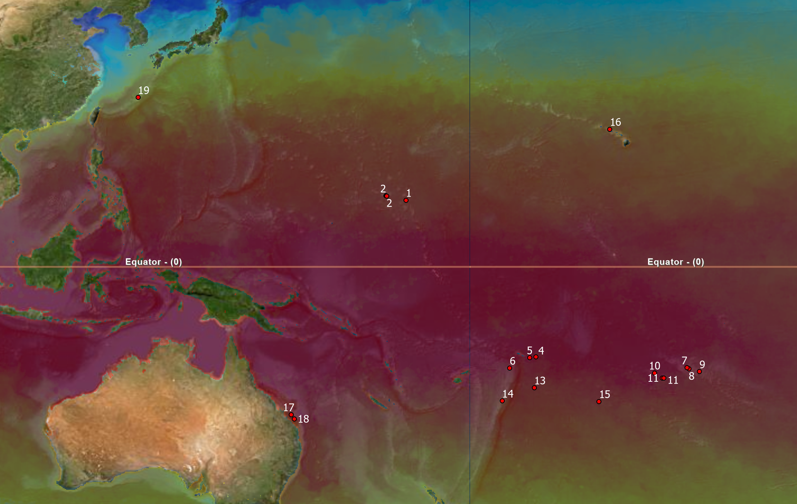
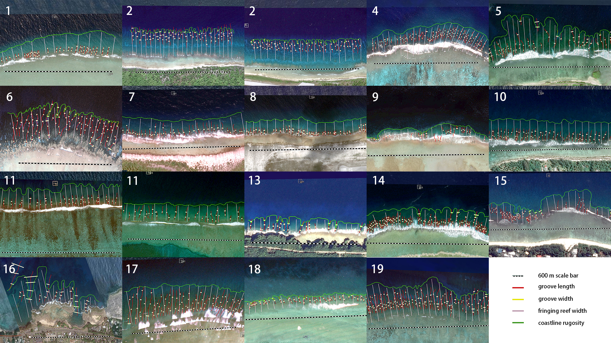

```{r setup, include=FALSE}
knitr::opts_chunk$set(echo = TRUE)
library(cowplot)
library(ggplot2)
library(tidyverse)
library(readxl)
library(dplyr)
```

```{r data import and reorganize, echo=TRUE, results='hold', include=FALSE}
# import data
data_LG <-read.csv("data/Length_G.csv")
data_RF <-read.csv("data/Rugosity_F.csv")
data_WF <-read.csv("data/Width_F.csv")
data_WG <-read.csv("data/Width_G.csv")
data_FR <-read.csv("data/FR_data.csv")
data_bio <- read.csv("data/BIO_data.csv")

# mean groove length
data_LG %>%
  group_by(Site_ID) %>%
  summarise_at(vars(Length_G), list(G_length = mean)) -> LG_mean 
# coastline Rugosity
data_RF$rugosity <- data_RF$Length / 600 
CL_rugosity <- data.frame(data_RF$Site_ID,data_RF$rugosity)
colnames(CL_rugosity) <- c('Site_ID','Rugosity') 
 # mean fringing width
data_WF %>%
  group_by(Site_ID) %>%
  summarise_at(vars(Length), list(F_width = mean)) -> WF_mean
# mean groove width
data_WG %>%
  group_by(Site_ID) %>%
  summarise_at(vars(Length), list(G_width = mean)) -> WG_mean 
# calculate groove density
LG_density <- table(data_LG$Site_ID) / 0.6
LG_density <- data.frame(LG_density)
colnames(LG_density) <- c('Site_ID','Density') 

# merge data
df_list <- list(data_FR,LG_mean,LG_density,WG_mean,WF_mean,CL_rugosity,data_bio)
df_all <- df_list %>% reduce(full_join, by='Site_ID')
df_all <- df_all[-c(2),] # remove outliner sites: S2
head(df_all)

annotation <- data.frame(
  ylabel = c("Groove length (m)","Groove density (/km)","Groove width (m)","Fringing reef width (m)", "Coastline Rugosity","SST")
)

```


## Introduction

Fringing reefs are widely distributed in the tropical and subtropical zones across the world. The structure of fringing reefs provide the habitats for the intertidal and subtidal organisms (*Menard et al. 2012* [^1]). Meanwhile, the morphology of fringing reefs are shaped by the reef-building organisms and the environment factors (*Duce et al. 2016* [^2]). Previous researches have studied the growth and morphology of fringing reefs from geology aspect (*Kennedy and Woodroffe 2002* [^3]) and the bathymetric distribution of corals on the fringing reefs (*Dai 1993* [^4]). But the connection between biodiversity and morphology of fringing reefs and their geographical differences has not been studied.    

Fringing reefs can be easily observed from the satellite images in Google Earth. The differences of fringing reefs can be observed along the latitude. The spurs and grooves structure is a distinct feature in the fringing reefs, which can be quatified morphologically. In this project, we would measure several morphological traits of fringing reefs and try to explore their connection with environmental factors and biological data. We are going to answer following questions: 

1. How is the **morphology of fringing reefs** distributed geographically? What are the differences along the latitude?

2. Is the morphology of fringing reefs correlated with the **biological data**?

3. What is the **correlation** between morphology of fringing reefs, biological data and environmental factor?


## Method

- We chose 19 sites (*Fig.1*) to analyze the correlation between morphological traits of fringing reefs and biological data, and its geographical difference across latitude.  

- The latitude of our study sites range from 23°S to 26°N. They are islands and atolls across northern and southern hemisphere. Nature coastline and fringing reefs are present in all of our sites. 

- The morphological traits of fringing reefs were analyzed from high resolution satellite images (0.15 m/pix) which collected from Google Earth. In Google Earth, three ground control points were annotated and WGS information was recorded in all of the images for the later georeferencing process in ArcGIS Pro. After the images were imported in ArcGIS Pro and georeferenced, line features were created for measuring the morphological traits of fringing reefs. We measured five types of morphological traits: 1. groove length, 2. groove width, 3. groove density, 4. fringing reef width and 5. coastline rugosity. Morphological traits were measured within a 600 meter segment in each site (*Fig. 2*). One outlier (Site 16) was removed in the following analysis.

- Total number, average body size and total biomass were used to represent the biological data in our study. In order to get the comparable biological data, our data was collected from Reef Life Survey (RLS) (https://reeflifesurvey.com/). The standardized survey methodology was applied in RLS database. We used *IMOS - National Reef Monitoring Network Sub-Facility - Global reef fish abundance and biomass* as our biological data sources.

- The biological data were selected by following conditions: their biogeographic realm are in Western and Middle Pacific, their survey depth are range from 3~8 m. The survey time is in daytime (11:00am~15:00pm).  

- Sea surface temperature (SST) data is downloaded from ArcGIS database (https://www.arcgis.com/home/item.html?id=7b421e42c17b43f8ad7222b8f71d09e7). The SST was the average from February and September in 2010.

- The statistics was analyzed by using R (ver 4.2.1). The function 'cor' was applied to calculate the Pearson correlation coefficient.




Fig.1 The map of study sites. The red dots indicate the location of study sites. The sites were named from 1~19 based on their latitudinal ranking (No.1 means the lowest latitude site). There are two sites in the same latitude, so their ID are the same. The color of basemap shows the sea surface temperature in February, 2010. 




Fig.2 The measurement of morphological traits in each site. Black and white stripe is the 600m scale bar. Red line is groove length. Yellow line is groove width. Pink line is fringing reef width. Green line is coastline rugosity.


## Result

- The latitude and SST is highly correlated (R=-0.92) in our study sites. Groove density shows the highest correlation with SST (*Fig.3 B*). In other words, there are more grooves when the sea temperature is lower or in higher latitude. The other morphological traits of fringing reef do not show obvious correlation with SST.

- Fringing reef width and groove length are negatively correlated with total fish number (*Fig.4 A,D*). Meanwhile, fringing reef width and groove length are correlated with each other (R=0.84).  

- All of the morphological traits and SST are not correlated with biomass (*Fig.5*).

- Average size of fish have negative correlation with groove density and positive correlation with groove width (*Fig.6 B,C*), which means the larger fish tend to appear in a place that have looser and wider grooves. 

- Morphological traits of fringing reef have higher correlation with biological data than the environmental data, SST. Different types of morphological traits might be able to reflect different aspect of biological data (*Fig.4*,*Fig.6*).


```{r data explore-1, echo=FALSE, results='hide', warning=FALSE, message=FALSE}

#calculate correlation between morphological traits and latitude
cor_1 <- list()
for (i in 1:5) {
  cor_1[i] <- cor(df_all[,i+7],df_all[,6])
}
cor_1 <- as.numeric(cor_1)
cor_1 <- round(cor_1,2)

slope_1 <- list()
for (i in 1:5) {
  mod <- lm(df_all[,6] ~ df_all[,i+7])
  cf <- coef(mod)
  slope_1[i] <- cf[2]
}
slope_1 <- as.numeric(slope_1)
slope_1 <- round(slope_1,2)

# Fig.1 relation between morphological traits and latitude

plot_list <- list()
for (i in 1:5) {
  df <- data.frame(
    x = df_all[,3],
    y = df_all[,i+7],
    label = df_all[,7] #lat rank
  )
  p <- ggplot(data = df, aes(abs(x), y))+
  geom_point(shape=21)+
  geom_smooth(method="lm", colour="black", size=0.5)+
  theme_light()+
  geom_text(hjust=0, vjust=0, label = df$label)+
  labs(subtitle = paste0("R=", cor_1[[i]]))+
  xlab("Latitude")+
  ylab(annotation$ylabel[i])
  plot_list[[i]] <- p
}
fig1 <- plot_grid(plot_list[[1]],plot_list[[2]],plot_list[[3]],plot_list[[4]],plot_list[[5]],align="h")

#calculate correlation between morphological traits and temperature
cor_1_1 <- list()
for (i in 1:5) {
  cor_1_1[i] <- cor(df_all[,i+7],df_all[,13])
}
cor_1_1 <- as.numeric(cor_1_1)
cor_1_1 <- round(cor_1_1,2)

slope_1_1 <- list()
for (i in 1:5) {
  mod <- lm(df_all[,24] ~ df_all[,i+13])
  cf <- coef(mod)
  slope_1_1[i] <- cf[2]
}
slope_1_1 <- as.numeric(slope_1_1)
slope_1_1 <- round(slope_1_1,2)

# Fig.1_1 relation between morphological traits and temperature

plot_list <- list()
for (i in 1:5) {
  df <- data.frame(
    x = df_all[,13],
    y = df_all[,i+7],
    label = df_all[,7] #lat rank
  )
  p <- ggplot(data = df, aes(abs(x), y))+
  geom_point(shape=21)+
  geom_smooth(method="lm", colour="black", size=0.5)+
  theme_light()+
  geom_text(hjust=0, vjust=0, label = df$label)+
  labs(subtitle = paste0("R=", cor_1_1[[i]]))+
  xlab("SST")+
  ylab(annotation$ylabel[i])
  plot_list[[i]] <- p
}
fig1_1 <- plot_grid(plot_list[[1]],plot_list[[2]],plot_list[[3]],plot_list[[4]],plot_list[[5]],align="h",labels=c("A","B","C","D","E"))
fig1_1

```

Fig.3 Relation between morphological traits and temperature


```{r data explore-2, echo=FALSE, results='hide', warning=FALSE, message=FALSE}
# Fig.2 relation between morphological traits and total observation number
cor_2 <- list()
for (i in 1:6) {
  cor_2[i] <- cor(df_all[,i+7],df_all[,17])
}
cor_2 <- as.numeric(cor_2)
cor_2 <- round(cor_2,2)

plot_list <- list()
for (i in 1:6) {
  df <- data.frame(
    x = df_all[,i+7],
    y = df_all[,17],
    label = df_all[,7] # lat rank
  )
  p <- ggplot(data = df, aes(x, y))+
  geom_point(shape=21)+
  geom_smooth(method="lm", colour="black", size=0.5)+
  theme_light()+
  geom_text(hjust=0, vjust=0, label = df$label)+
  labs(subtitle = paste0("R=", cor_2[[i]]))+
  xlab(annotation$ylabel[i])+
  ylab("total_number")
  plot_list[[i]] <- p
}
fig2 <- plot_grid(plot_list[[1]],plot_list[[2]],plot_list[[3]],plot_list[[4]],plot_list[[5]],plot_list[[6]],align="h",labels=c("A","B","C","D","E","F"))
fig2

```

Fig.4 Relation between morphological traits and total observation number of fish

```{r data explore-3, echo=FALSE, results='hide', warning=FALSE, message=FALSE}
# Fig.3 relation between morphological traits and Biomass
cor_3 <- list()
for (i in 1:6) {
  cor_3[i] <- cor(df_all[,i+7],df_all[,18])
}
cor_3 <- as.numeric(cor_3)
cor_3 <- round(cor_3,2)

plot_list <- list()
for (i in 1:6) {
  df <- data.frame(
    x = df_all[,i+7],
    y = df_all[,18],
    label = df_all[,7]
  )
  p <- ggplot(data = df, aes(x, y))+
  geom_point(shape=21)+
  geom_smooth(method="lm", colour="black", size=0.5)+
  theme_light()+
  geom_text(hjust=0, vjust=0, label = df$label)+
  labs(subtitle = paste0("R=", cor_3[[i]]))+
  xlab(annotation$ylabel[i])+
  ylab("Biomass")
  plot_list[[i]] <- p
}
fig3 <- plot_grid(plot_list[[1]],plot_list[[2]],plot_list[[3]],plot_list[[4]],plot_list[[5]],plot_list[[6]],align="h",labels=c("A","B","C","D","E","F"))
fig3

```

Fig.5 Relation between morphological traits and total biomass of fish

```{r data explore-4, echo=FALSE, results='hide', warning=FALSE, message=FALSE}


# Fig.4 relation between morphological traits and Size class
cor_4 <- list()
for (i in 1:6) {
  cor_4[i] <- cor(df_all[,i+7],df_all[,16])
}
cor_4 <- as.numeric(cor_4)
cor_4 <- round(cor_4,2)

plot_list <- list()
for (i in 1:6) {
  df <- data.frame(
    x = df_all[,i+7],
    y = df_all[,16],
    label = df_all[,7]
  )
  p <- ggplot(data = df, aes(x, y))+
  geom_point(shape=21)+
  geom_smooth(method="lm", colour="black", size=0.5)+
  theme_light()+
  geom_text(hjust=0, vjust=0, label = df$label)+
  labs(subtitle = paste0("R=", cor_4[[i]]))+
  xlab(annotation$ylabel[i])+
  ylab("Size class")
  plot_list[[i]] <- p
}
fig4 <- plot_grid(plot_list[[1]],plot_list[[2]],plot_list[[3]],plot_list[[4]],plot_list[[5]],plot_list[[6]],align="h",labels=c("A","B","C","D","E","F"))
fig4

#Fig5 cmake a pair plot to check the relation within morphological traits
df_m <- data.frame(df_all[,8],df_all[,9],df_all[,10],df_all[,11],df_all[,12])
colnames(df_m) <- c('Groove length','Groove density','Groove width','Fringing reef width','Coastline rugosity') 
fig5 <- GGally::ggpairs(data = df_m)

#Fig6 make a pair plot to check the relation between lat and biodiversity
head(df_all)
df_b <- data.frame(df_all[,6],df_all[,16],df_all[,17],df_all[,18])
colnames(df_b) <- c('Latitude','size_class','total_number','biomass') 
fig6 <- GGally::ggpairs(data = df_b)

#Fig7 make a pair plot to check the relation between SST and biodiversity
head(df_all)
df_sst <- data.frame(df_all[,24],df_all[,16],df_all[,17],df_all[,18])
colnames(df_sst) <- c('SST','size_class','total_number','biomass') 
fig7 <- GGally::ggpairs(data = df_sst)

#型態之間的相關性
#緯度和生物多樣性間的相關
#如何做進一步統計分析?分群?

```

Fig.6 Relation between morphological traits and average size class of fish

## Discussion

- Higher groove density in higher latitude might be due to lower water temperature. Because reef building organism can grow better in warmer environment. If the reef building organism grow slower, the compactness of fringing reefs would be harder to maintain. Therefore, the effect of erosion can create more obvious pattern to the reefs in low water temperature sites (*Fig.3 B*). (need more references about the pattern of fringing reefs in different environment)

- The negative correlation between groove length, fringing reef width and total number(*Fig. 4 A,D*) might be caused by the other factors, such as the type or the terrain of substrate. There are higher proportion of sandy substrate in the sites that have longer grooves and wider fringing reef (*Fig.2 2,17*), which is less reefal and lower structurally complex. Reefal or higher complexity area tend to have more fish abundabce base on previous studies. The bathymetry data is needed for further analysis. 

- The unobvious correlation between biomass and morphological traits (*Fig.3*) might be due to the methodology of fish survey in RLS database. Among three of our biological data, only biomass is estimated data that can not be measured by the observer directly. Therefore, the actual correlation might not be shown because of the low precision of the measurement of biomass in RLS data.

- Wider groove width have positive correlation with average size class of fish (*Fig.6 C*) because wider groove might be a more more suitable shelter and hunting ground for larger fish. On the other hand, groove density is negatively correlated (*Fig.6 B*). The reason might be its high correlation with SST (*Fig.3 B*). However, this result is opposite to Bergmann's law. The composition of fish species should be further analyzed in our study.

- The morphology of fringing reefs shows the correlation with total fish number and average size class, and their correlation even higher than environmental factor (*Fig.4*,*Fig.6*). Our result suggests that the morphology of fringing reefs might be an important factor to shape the fish community.

- Due to the insufficiency of clear satellite images and biological data, the data below 10°N(S) is absent (*Fig.1*). The more well-distributed data is needed for the further analysis. 

- The significant of project is we can know more about how does structure of habitats maintain the biodiversity, which can provide a new assessment for evaluating the condition of habitats. We can also figure out the distribution and the pattern of the morphological traits of fringing reefs, which can benefit the marine resources and coastal management.


## Reference

[^4]: [Dai, C. F. (1993). Patterns of coral distribution and benthic space partitioning on the fringing reefs of southern Taiwan. Marine Ecology, 14(3), 185-204.](https://doi.org/10.1111/j.1439-0485.1993.tb00479.x)

[^2]: [Duce, S., Vila-Concejo, A., Hamylton, S. M., Webster, J. M., Bruce, E., & Beaman, R. J. (2016). A morphometric assessment and classification of coral reef spur and groove morphology. Geomorphology, 265, 68-83.](https://doi.org/10.1016/j.geomorph.2016.04.018)

[^3]: [Kennedy, D. M., & Woodroffe, C. D. (2002). Fringing reef growth and morphology: a review. Earth-Science Reviews, 57(3-4), 255-277.](https://doi.org/10.1016/S0012-8252(01)00077-0)

[^1]: [Menard, A., Turgeon, K., Roche, D. G., Binning, S. A., & Kramer, D. L. (2012). Shelters and their use by fishes on fringing coral reefs. PloS one, 7(6), e38450.](https://doi.org/10.1371/journal.pone.0038450)

